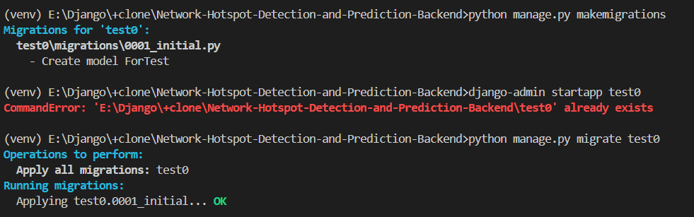

# Network-Hotspot-Detection-and-Prediction

## Quick Start

1. ### 如何运行项目

  如果使用 vscode 运行，可以参考以下链接

  https://blog.csdn.net/qq_19915249/article/details/114291027
  只要做到可以执行 pip install django 应该就可以跑后端的项目了

  

  *** 注意：要使用项目的 venv 环境，因为这里已经配置好了相关依赖

  如果不行的话可以自己创造虚拟环境，根据 requirements.txt 文件配置相关依赖

  运行项目命令：

  python manage.py runserver

由于8000端口会与tugraph冲突，所以要监听其他端口，比如8001端口：
python manage.py runserver 127.0.0.1:8001

2. ### 可以创建多个应用来分开项目不同的功能，命令如下

  django-admin startapp 'app名'

  

  *** 注意：记得在项目目录的 settings.py 声明 app

  一般情况下只要修改 models.py 和 views.py 文件

  一开始只有以上这些文件，可以根据需求自己添加 urls.py（必）, serializers.py 等文件

3. ### 数据库相关的操作

  *** 注意：记得查看项目目录的 settings.py 声明的 Database 是否于自己的数据库对应

  先在某个 app 里的 models.py 文件定义数据模型

  然后执行这两个命令：

  python manage.py makemigrations

  python manage.py migrate 'app名'

如果想一次性迁移所有app，则不用输入app名：python manage.py migrate

  

  别管那条报错的，手滑执行错了命令

# 可能遇到的问题

```
error: Microsoft Visual C++ 14.0 or greater is required. Get it with "Microsoft C++ Build Tools": https://visualstudio.microsoft.com/visual-cpp-build-tools/
```

在非常干净的（windows）环境中安装依赖可能会遇到这个报错。然后我直接把backports.zoneinfo==0.2.1这个安装要求注释掉了。
