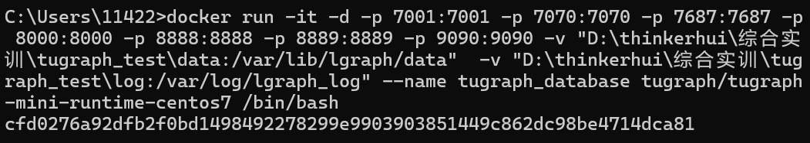

# Network-Hotspot-Detection-and-Prediction

## Quick Start

1. ### 如何运行项目

  如果使用 vscode 运行，可以参考以下链接

  https://blog.csdn.net/qq_19915249/article/details/114291027
  只要做到可以执行 pip install django 应该就可以跑后端的项目了

  

  *** 注意：要使用项目的 venv 环境，因为这里已经配置好了相关依赖

  如果不行的话可以自己创造虚拟环境，根据 requirements.txt 文件配置相关依赖

  运行项目命令：

  python manage.py runserver

由于8000端口会与tugraph冲突，所以要监听其他端口，比如8001端口：
python manage.py runserver 127.0.0.1:8001

1. ### 可以创建多个应用来分开项目不同的功能，命令如下

  django-admin startapp 'app名'

  

  *** 注意：记得在项目目录的 settings.py 声明 app

  一般情况下只要修改 models.py 和 views.py 文件

  一开始只有以上这些文件，可以根据需求自己添加 urls.py（必）, serializers.py 等文件

3. ### 数据库相关的操作

  *** 注意：记得查看项目目录的 settings.py 声明的 Database 是否于自己的数据库对应

  先在某个 app 里的 models.py 文件定义数据模型

  然后执行这两个命令：

  python manage.py makemigrations

  python manage.py migrate 'app名'

如果想一次性迁移所有app，则不用输入app名（这个有可能会引发一些问题）：python manage.py migrate

  

  别管那条报错的，手滑执行错了命令

## 事件图谱后端

事件图谱需要有图数据库来存储，本项目选用的是Tugraph。

所以需要配置和tugraph相关的环境。因为Tugraph只支持linux环境，为了方便大家自己进行配置，这里遵循官方的docker方式部署。

进行下面的操作前要确保你已经安装好了docker环境。

### 拉取镜像

下载 runtime mini docker镜像：

`docker pull tugraph/tugraph-mini-runtime-centos7`

有可能会遇到网络问题。我的解决方法是开vpn，然后在docker desktop下载。

### 运行镜像

注意下面的第一条命令需要进行修改：`D:\thinkerhui\综合实训\tugraph_test\data`和 `D:\thinkerhui\综合实训\tugraph_test\log`要改为自己本地硬盘的某个路径，前者存放的是Tugraph的数据，后者存放的是Tugraph的运行日志。

```PowerShell
docker run -it -d -p 7001:7001 -p 7070:7070 -p 7687:7687 -p 8000:8000 -p 8888:8888 -p 8889:8889 -p 9090:9090 -v "D:\thinkerhui\综合实训\tugraph_test\data:/var/lib/lgraph/data"  -v "D:\thinkerhui\综合实训\tugraph_test\log:/var/log/lgraph_log" --name tugraph_database tugraph/tugraph-mini-runtime-centos7 /bin/bash

```



### 恢复/放置数据

把数据库文件夹 ` eventgraph`复制到你挂载的目录，比如对于我就是  `D:\thinkerhui\综合实训\tugraph_test\data`

```
lgraph_server -c lgraph.json --directory /var/lib/lgraph/data/eventgraph -d start
```

### 运行tugraph服务

运行tugraph服务并启动tugraph前端，注意 `--directory /var/lib/lgraph/data/eventgraph`意味着要从该目录中加载数据库。

运行下面的第一行命令之后会进入容器并开启一个终端，第二条命令就是要在这个终端里面运行。

```
docker exec -it tugraph_database /bin/bash
lgraph_server -c /usr/local/etc/lgraph.json --directory /var/lib/lgraph/data/eventgraph -d start && cd /usr/local/share/lgraph/tugraph-db-browser/ && nohup pnpm run dev &
```

### 测试

在成功运行之后，可以通过localhost:7070来访问前端。

### 其他的一些命令（这部分可以略过）

数据导出:

```
lgraph_export -d /var/lib/lgraph/data -e /var/lib/lgraph/data/event -g eventgraph1 -u admin -p 73@TuGraph -f json
```

导入数据：

把数据库文件夹 ` eventgraph`复制到你挂载的目录，比如对于我就是  `D:\thinkerhui\综合实训\tugraph_test\data`

然后执行导入命令：

`docker exec -d tugraph_database lgraph_import --online false -c /var/lib/lgraph/data/eventgraph/import.config -d /var/lib/lgraph/data/ -u admin -p 73@TuGraph -g eventgraph1  `

```shell
lgraph_import --online false -c /var/lib/lgraph/data/eventgraph_data/import.conf -d /var/lib/lgraph/data/ -u admin -p 73@TuGraph -g eventgraph1
```

**实测数据导入和数据恢复会出现各种小问题，不好用。**

数据备份

```
lgraph_backup -s /var/lib/lgraph/data/ -d /var/lib/lgraph/data/eventgraph -c true
```

# 可能遇到的问题

```
error: Microsoft Visual C++ 14.0 or greater is required. Get it with "Microsoft C++ Build Tools": https://visualstudio.microsoft.com/visual-cpp-build-tools/
```

在非常干净的（windows）环境中安装依赖可能会遇到这个报错。然后我直接把backports.zoneinfo==0.2.1这个安装要求注释掉了。
